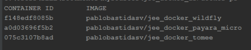
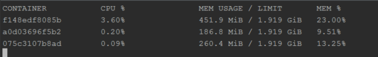

## JEE in docker

The idea of this repo is to check the memory consumption of a very simple JEE application in 
 different applications server. 

Docker images running:

Docker stats:

In this example we can see 3 application server with the same simplistic application deploying
in it, let's see the result, specially memory usage:

|Server        | MEM Usage|
|--------------|----------|
|Wildfly       |  451.9 Mb|
|Payara micro  |  186.8 Mb|
|TomEE         |  260.4 Mb|

We should to take in count that these are three diferents servers, I mean, _Wildfly_ is 
certified, _TomEE_ is compatible and _Payara micro_ is web profile ([web profile vs full server](https://glassfish.java.net/webprofileORfullplatform31x.html)).

